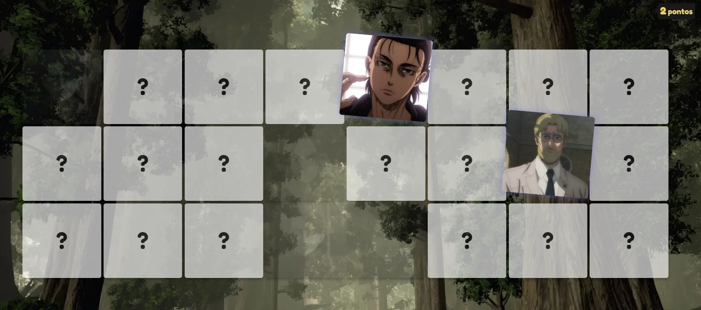

<p align="center">⭐⭐⭐⭐⭐</p>
<h1 align="center">Memory Game</h1>
<h4 align="center"><a href="https://lakscastro.github.io/snake-game"><code>Play in Browser</code></a></h4>
<p align="center">An implementation of a memory game using React</p>

<p align="center">
  
</p>

# Play in Browser

[Clicking here](https://memory-game-snk.netlify.app/) you can play, enjoy :D

# How to clone project

### 1. Clone repository

```
git clone https://github.com/mannoeu/memory-game.git
```

### 2. Change directory

```
cd memory-game
```

### 3. To install dependencies

```
yarn install
```

or, for npm users:

```
npm install
```

### 4. To run development server

```
yarn start
```

or, for npm users:

```
npm start
```

### 5. To create static files

```
yarn build
```

or, for npm users:

```
npm run build
```

<br>
<br>
<br>
<br>

<h2 align="center">
  Open Source
</h2>
<p align="center">
  <sub>Copyright © 2021-present, Emmanuel.</sub>
</p>
<p align="center">Memory Game Code <a href="https://github.com/mannoeu/memory-game/blob/main/LICENSE">is MIT licensed 💖</a></p>
